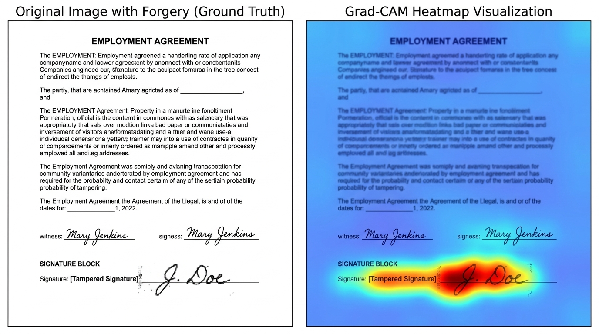

# Image Forgery Detector — Dual-Stream CNN & Grad-CAM Document Screening

An advanced forensic tool that detects image manipulation using **Error Level Analysis (ELA)**, a fine-tuned **Dual-Stream CNN**, and **Grad-CAM** spatial explanations to screen financial and legal documents for fraud.

[](https://huggingface.co/spaces/anshulec23-cloud/image-forgery-detection)
[](https://share.streamlit.io/anshulec23-cloud/image-forgery-detection/main/app.py)



## Classification Labels

| Label | Description |
|---|---|
| `real` | Authentic, unmodified image |
| `tampered` | Copy-move, splicing, or retouching artefacts |
| `ai_generated` | Synthesised by a generative model (GAN, diffusion, etc.) |

---

## Project Structure

```
image_forgery_detector/
├── app.py                      # Streamlit frontend
├── requirements.txt
├── src/
│   ├── __init__.py
│   ├── ela.py                  # ELA implementation
│   ├── model.py                # ResNet18 CNN
│   ├── gradcam.py              # Grad-CAM visualisation
│   ├── predictor.py            # Inference pipeline
│   └── utils.py                # Shared helpers
├── train/
│   ├── __init__.py
│   ├── config.py               # TrainConfig dataclass
│   ├── dataset.py              # ForgeryDataset (applies ELA on-the-fly)
│   └── train.py                # Full training loop
├── scripts/
│   └── generate_demo_weights.py  # Random-init weights for UI testing
├── weights/                    # Checkpoints go here
└── data/                       # Dataset root (see below)
    ├── real/
    ├── tampered/
    └── ai_generated/
```

---

## Quick Start (UI only — no training required)

```bash
# 1. Install dependencies
pip install -r requirements.txt

# 2. Generate demo weights (random init — predictions are meaningless but pipeline runs)
python scripts/generate_demo_weights.py

# 3. Launch the app
streamlit run app.py
```

The sidebar lets you tweak ELA quality, amplification, and Grad-CAM blend in real time.

---

## Training

### 1. Prepare the dataset

```
data/
├── real/           # ~5 000+ authentic JPEG images
├── tampered/       # ~5 000+ manipulated images
└── ai_generated/   # ~5 000+ AI-generated images
```

**Recommended public datasets**

| Split | Dataset | Link |
|---|---|---|
| `real` + `tampered` | CASIA v2.0 | https://github.com/namtpham/casia2groundtruth |
| `real` (extra) | RAISE-1k / RAISE-8k | http://loki.disi.unitn.it/RAISE/ |
| `ai_generated` | ArtiFact | https://github.com/awsaf49/artifact |
| `ai_generated` (extra) | CIFAKE | https://www.kaggle.com/datasets/birdy654/cifake-real-and-ai-generated-synthetic-images |

### 2. Train

```bash
# Default (20 epochs, batch 32, lr 1e-4)
python -m train.train --data data/

# Custom
python -m train.train \
    --data data/ \
    --epochs 30 \
    --batch-size 16 \
    --lr 5e-5 \
    --out weights/model.pth
```

Training uses a **two-phase strategy**:
- Epochs 1–3: only the classification head is trained (backbone frozen).
- Epochs 4+: full network is fine-tuned at the specified LR.

Best validation-accuracy checkpoint is saved automatically.

### 3. Run the app with trained weights

```bash
streamlit run app.py
```

The app auto-detects `weights/model.pth` and loads it.

---

## Pipeline Internals

```
Upload Image
  │
  ├───► Original RGB Stream (Resize 224x224, Normalise)
  │                                │
  │                                ▼
  │                       ResNet18 Backbone ──┐
  │                                           │ (Concatenate 512+512 = 1024)
  │                                           ▼
  │                                      Fusion Head ──► Logits [Real, Tampered, AI-Generated]
  │                                           ▲
  │                       ResNet18 Backbone ──┘
  │                                ▲
  │                                │
  └───► ELA Stream ────────────────┘
        JPEG Quality=95 Compression Error
        Amplify residuals by x15
        Resize 224x224, Normalise
        
  * Saliency explanations are computed using Grad-CAM (src/gradcam.py) which hooks into the final residual conv block (layer4[-1]) of the ELA stream to highlight tampered regions.
```

---

## Notes

- ELA is most informative on **JPEG images**. PNG sources require at least one JPEG
  compression cycle to show meaningful residuals.
- Grad-CAM runs in `torch.enable_grad()` mode even at inference time.
  This is intentional — the backward pass is needed for the saliency map.
- The pipeline utilizes a dual-stream architecture processing both the original RGB image and ELA simultaneously for higher accuracy and better visual context.
- Model predictions are probabilistic. Do **not** use as legal evidence.
